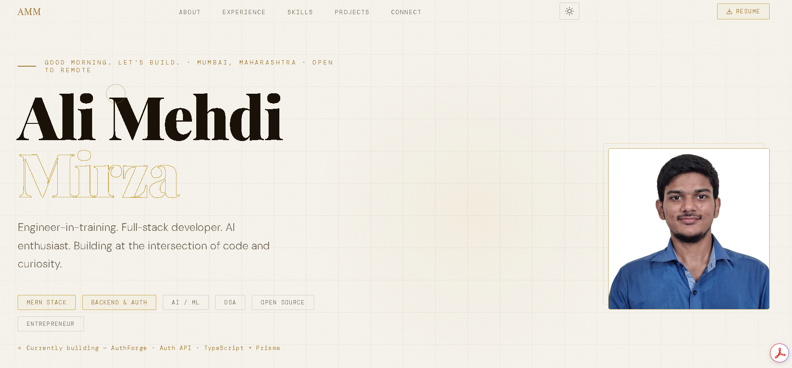

  <h1>⚡ Ali Mehdi Mirza — Personal Portfolio</h1>

  
<em>A zero-dependency, high-performance developer portfolio engineered for speed, precision, and impact.</em>

  
  &nbsp;
  
  &nbsp;
  
  &nbsp;
  

---

## 📸 Preview

  

---

## ⚡ Overview

This is the source code behind my personal portfolio — built with a strict **"less is more"** engineering philosophy. No React. No Vue. No bloat.

The entire experience is crafted in **pure HTML, CSS, and Vanilla JavaScript**, delivering:
- Sub-second load times on any connection
- A dark-themed UI with gold (`#c9a84c`) typography for a premium, consistent brand
- Interactive micro-experiences engineered from first principles using native Web APIs

Every line of code here was a deliberate choice — not a framework default.

---

## ✨ Engineering Highlights

| Feature | What's Under The Hood |
|---|---|
| 🕐 **Smart Contextual Greeting** | Time-aware JS logic dynamically changes the hero section based on the user's local timezone — morning, afternoon, or night |
| 🤖 **"Explain Like I'm 5" AI Toggle** | Custom UI toggle on technical projects like PashuNet-AI — switches between deep technical jargon and plain-language summaries |
| 🖱️ **Magnetic Custom Cursor** | Web API cursor with mathematical interpolation via `requestAnimationFrame` for smooth, tactile hover feedback |
| 👁️ **Scroll-Triggered Animations** | Intersection Observer API powers all entrance animations — zero scroll-event listeners, zero jank |
| 📐 **Fluid Responsive Layout** | CSS Grid + Flexbox with CSS Custom Properties — adapts perfectly from mobile to ultrawide |
| 🎨 **CSS Keyframe Animation System** | All animations hand-written in CSS — no GSAP, no Framer Motion |

---

## 🛠️ Tech Stack
